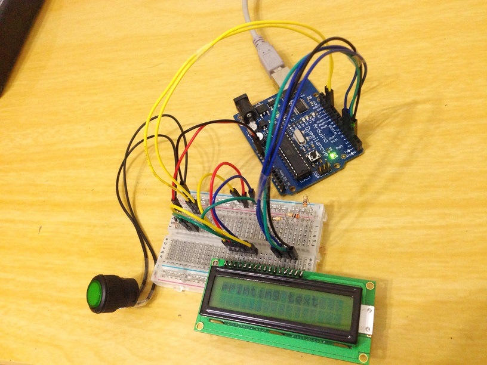
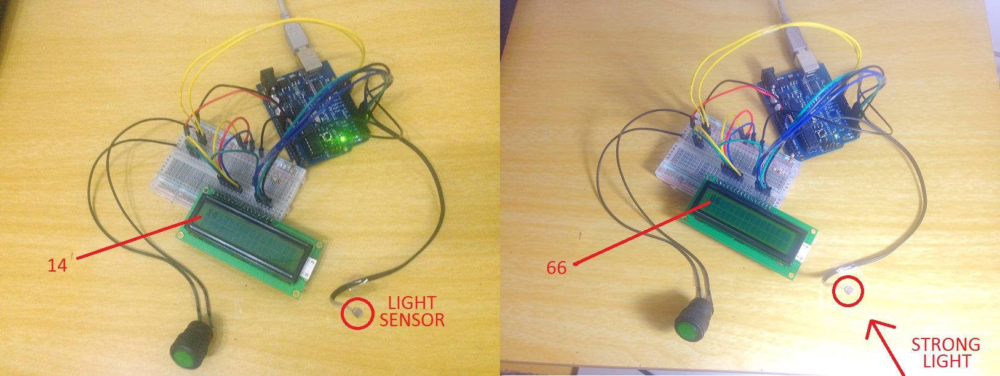
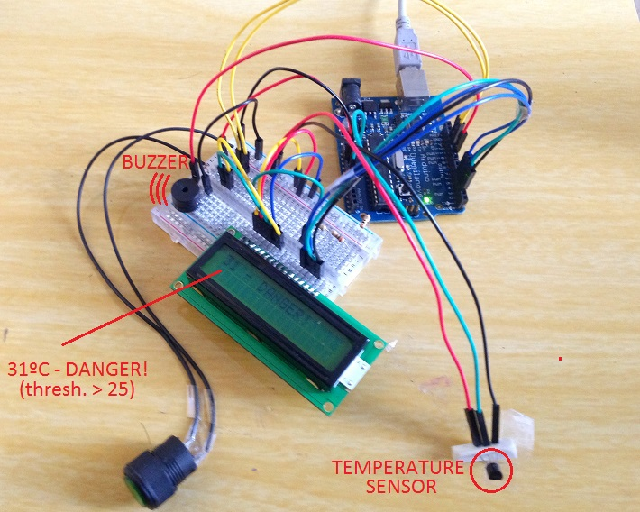

# ArduinoProjects
A repository where I'll store some experiments I do with an Arduino I've acquired

####01 - Led blink
The 'hello world' of Arduino projects.  
A blinking LED light, that turns on for 2 seconds, blinks a bit, then repeats.

####02 - Button Push
For those who want to control a led with a one-way button, without using resistors.  
An on/off button that toggles an LED light.

####03 - LCD Dispaly control
Displaying text with some timing in an LCD display, and an on/off switch.  
See it here displaying "Printing text":

####04 - Light Sensor
Displaying the value gathered from an analogic photo sensor resistor in an LCD display.  
See it here in two instances, one in normal ambient light (14/100) and one with a strong light source (66/100).  
By covering it, we can get 0, and by literally touching a very bright light in it, we can get 100.

####05 - Temperature Alarm
Using a temperature sensor to gather ambient temperature in degrees celsius, and displaying it on an LCD display.  
If the temperature is above 25ºC (77ºF), a buzzer sounds, and a 'DANGER' message is shown.  
It's annoying, but just a way to test my newly acquired components on Arduino.   

